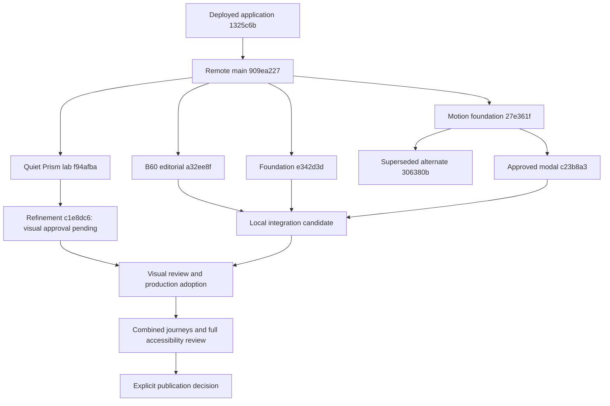

# Website integration plan, September 20, 2026

Owner: **Coordinate website workstreams and merge plan**, task
`01a0bf67-f456-7e32-b581-a233af6149fe`. Planning checkout: `6b03`, branch
`codex/website-integration-plan-20260920`. This is a local planning checkpoint.
It authorizes no implementation in another checkout, merge, push, PR or deployment.

## Recommendation

Start a future integration branch from the freshly verified remote main,
currently **909ea2275104bc73f483ba7f1c5591db4d17a5b1**. Import the approved B60
editorial record, the responsive foundation, and the approved final modal branch.
Then adopt the accepted Quiet Prism components in a separate production change
from frozen refinement **c1e8dc605aa66e208f446d464588ac7f9e92ce53** after Jacob
has reviewed it. Implementation is complete; final visual approval is pending.
Keep the deferred dedicated-page copy and older portfolio experiments separate.

Do not merge every branch. Much of the apparent backlog already shipped. Several
unmerged branches are alternative implementations, and the visual lab is a prototype
route, not a production adoption patch. Preserve their history and unique assets.

The next useful result is one integrated local preview with an exact commit,
reconciled copy register, all requested card families and existing modal behavior.
Visual/content acceptance and publication are two later, distinct decisions.

## Evidence boundary and current baseline

Audit began at 2026-09-20 15:21 UTC. The machine inventory was captured at
15:28:58 UTC; active work can change afterward. See
[the machine inventory](reviews/integration-inventory-20260920.json) for every
worktree, local/tracking ref, complete SHA, changed path, dirty/lock snapshot,
patch-equivalence check and conflict probe.
The follow-up `quietPrismHandoff` entry pins the completed refinement and three
additional conflict probes; the original inventory remains a historical snapshot.

- Read repository STATUS, working agreement, AGENTS, Genesis protocol, content
  register and style/voice/data authorities. Read Exchange entry point, notes,
  current brief, coordination/model rules, website card and relevant dated inbox.
- Exchange intake fingerprint:
  `bec1eb6ee47d7b9003892e3f9bed1c06371bf22f3995b0106e650ca9c095582b`,
  observed 15:21:36 UTC and unchanged at the 15:27:39 checkpoint. CURRENT and the
  website card still contain September 6 pointers; newer inbox evidence and
  Jacob's direct instructions determine the website work. Pending historical
  events have not been globally reconciled by this task.
- Live GitHub branch lookup matched cached `origin/main` at `909ea227`.
  All 11 PRs returned by the live repository query are merged; no open PR exists.
  The current unpublished motion, foundation, editorial and lab tips are local.
  A second remote read at 15:37:57 UTC confirmed the same main SHA and no open PRs;
  the raw PR/workflow metadata is saved in the inventory JSON.
- [PR 11](https://github.com/jacobmedley/jacobmedley.com/pull/11) merged application
  `cb9ebdfca58cbf37931a8351a353f0c5790407c1` as
  `1325c6bf31dce1b3483f17da1386d44d610accf2`.
  [Deployment 35418473415](https://github.com/jacobmedley/jacobmedley.com/actions/runs/35418473415)
  reports success. Main `909ea227` adds only STATUS and browser-release documentation
  to that deployed tree. Last recorded live version is v12.160.
- Earlier [PR 10](https://github.com/jacobmedley/jacobmedley.com/pull/10),
  [PR 9](https://github.com/jacobmedley/jacobmedley.com/pull/9),
  [PR 8](https://github.com/jacobmedley/jacobmedley.com/pull/8) and
  [PR 7](https://github.com/jacobmedley/jacobmedley.com/pull/7) are merged.
  Their launch, card, art, resume and accessibility-fix work is ancestry, not new
  integration scope. Fresh GitHub status is not a fresh browser/cache audit.

## Checkout inventory

Numbered directories below are under
`C:\Users\jacob\.codex\worktrees\<id>\jacobmedley.com`.
"Clean / none" means no tracked/untracked Git changes and no `.tree-lock` at
the inventory timestamp. It does not transfer ownership. Verification codes refer
to the evidence table below; these are historical checks, not reruns by this audit.

| Checkout and owner/task | Branch and exact HEAD | Changed area and acceptance | Dirty / lock; disposition |
| --- | --- | --- | --- |
| `C:\dev\jacobmedley.com`; original website work | `main` · `a49e4d7a9451cf27442f0e7c14514b76883befab` | Old source plus uncommitted case-study work/assets; 85 commits behind remote main. Approval and test coverage of the current dirty tree are not established. | Dirty: four tracked files and seven untracked top-level entries; no lock currently present. Preserve; do not pull, reset, clean or use as integration base. |
| `C:\dev\jacobmedley-brand-wave`; **Design local agent runner** website wave | `work/portfolio-brand-wave-20260906` · `386895537e10a7cdb1aba1ccbaec1a845f403fd2` | Initial brand/card wave. V0; fully in main ancestry. | Clean / none. Already delivered; keep history. |
| `C:\dev\jacobmedley-launch`; launch owner recorded in launch docs/PR 7 | `release/portfolio-brand-wave-launch` · `1407dd351256dcd94c7b4556488fc79dee166e40` | Launch and dedicated site baseline; PR 7 publication explicitly authorized historically. V0. | Clean / none. Already delivered. |
| `8350`; **Continue portfolio updates**, **Phase 0 - Plan**, **Phase 1 - Card Design**, **Phase 2 - Refine**, **Phase 3 - Website**, **Phase 4 - Card** | `codex/website-refinement-stage1-20260909` · `09c6125f6c25ad3091410905ba438180798f7d94` | Dashboard, stages 1–4, motion/network/cards. V1. Later appearance and controls supersede some early decisions. | Clean / none. Entire tip is in main ancestry; no replay. |
| `6fa6`; **Refine portfolio card art and mosaic**, **Finish website refinement**, **Perform independent release audit**, **Update sticky header visibility**, **Redesign Resume timeline** | `codex/website-art-layout-20260910` · `9508686b0f80193e87740d243b2adb2a1cb302d1` | Horizontal art, modal layouts, supporting schematics, resume disclosure and Figma handoff. V2. | Clean / none. Entire tip is in main ancestry; retain newer main behavior. |
| `4b5e`; **Refine portfolio motion and visual system**, **Unblock release for WCAG 2.0 AA** | `codex/website-visual-system-20260912` · `e2995d7fb703d4641562df1903b70adb3dfca3fc` | Visual system, hero, disclosure, ACC-B01/B02/B03 fixes, clean export, patched dependency graph. V3; PR 9 delivered. | Clean / none. Already delivered. Full future conformance review remains separate. |
| `C:\dev\jacobmedley-copy-20260917`; **Fix animation and update sheet** | `codex/copy-animation-20260917` · `d8d7380215d6d861725e625c2f462a7f60b0062a` | Broad B56 copy pass plus continuing hero; V4. Main-only subset delivered under B57, dedicated pages explicitly deferred. | Clean / none. Retain six dedicated source deltas; do not merge the whole commit. |
| `X:\website-release-20260919`; **Fix main site content** | `codex/main-site-wrapup-20260919` · `e342d3d24c848bc454461afa47c09c949456707d` | One unpublished commit above main: education padding/footer, experience focus/rule spacing, hero CTA stack, single-column CTA width, supplied Hydra mark, program/evidence docs. V5. Changes requested; no separate final visual approval found. | Clean / none. Integration candidate; published B57/B59 ancestry comes along without replay. |
| `2284`; **Unify main-site copy and Jacob’s editorial…** | `codex/main-site-editorial-20260919` · `a32ee8f9708c494b9b6c6d11c3597fe14356653e` | Editorial report and B60 approval. Exact four mentorship bullets and `How I lead the work` approved. No production component implementation. V6. | Clean / none. Merge record before implementing copy; no need to ask again about B60 wording. |
| `a003`; **Refine hero motion and accessible modal…** | `codex/motion-modal-refinement-20260919` · `27e361f243d0588d871b673e54222bbb5a5c6613` | Roomy hero reveal, modal/mobile lifecycle, preloading and load/error/retry. V7. Original desktop depth superseded. | Clean / none. Preserve through the descendant `c23b8a3`; do not merge twice. |
| `5074`; **Refine modal camera focus pull**, task `01a0bb10-aec3-74f1-9917-1397032a7024` | `codex/modal-camera-pullback-20260919` · `306380b8baf0f46e9428d8ceee95c92ca2e00608` | Parallel 1.04s camera-pullback experiment. V7. Later direct direction rejects moving/depth-treated page. | Clean / none. Superseded alternative; preserve branch and unique test frames, exclude implementation. |
| `5a43`; **Refine modal camera focus pull**, task `01a0bb11-4163-7263-b6d4-38d791317fbf` | `codex/modal-camera-pullback-refinement-20260919` · `c23b8a39d801500e8e0ec6d435c26fa38860dc70` | Stationary page, fixed 18px backdrop blur, sharp 400ms modal fall/fade/.975 scale, 260ms close; includes `27e361f`. V8. Jacob's later user message says “Aproved.” | Clean / none. Approved local integration candidate. Merge descendant branch, not its final dependent commit alone. |
| `a64d`; **Explore unified card materials and visual…**, then **Refine Quiet Prism cards** | `codex/visual-system-lab-20260919` · `f94afbacde504c22ea2d3db099eb2e45b13dbc33` | Unlinked noindex lab, card materials, B61/B62, native Experience animation. V9. Direction selected, latest refinement requested; this tip is not final visual acceptance. | Clean / none. Historical base for active refinement; no blanket production merge. |
| `6d80`; **Refine Quiet Prism motion and layout** | `codex/quiet-prism-refinement-20260920` · `c1e8dc605aa66e208f446d464588ac7f9e92ce53` at follow-up | Completed 13 annotations, five hero families, scroll shine, hover acceleration/slow hold, contextual motifs, quiet waves and leadership columns. V11. Final visual approval pending. | Clean / none, verified after handoff. Selective production adoption only after review; preserve source branch. Rollback `f94afbacde504c22ea2d3db099eb2e45b13dbc33`. |
| `C:\dev\jacobmedley-handoff`; Claude website protocol task | `claude/genesis-handoff-protocol-5hzaqj` · `7dced72b10195bfe3c2b70881dd946fb3e21b573` | Three old documentation commits. Core concepts adopted in main's `023bb11`, but not patch-identical. More verbose protocol contains obsolete ownership/closeout claims. V10. | Clean / none. Preserve; review unique prose separately, do not replace current governance wholesale. |
| `6b03`; this task | `codex/website-integration-plan-20260920` · base `909ea2275104bc73f483ba7f1c5591db4d17a5b1` | This plan and inventory only. Final commit goes in Genesis and the task handoff. | Own lock during drafting; released after checkpoint. No application edits. |

The original dirty checkout's tracked changes are `app/globals.css`,
`components/sections/CaseStudiesSection.tsx`, STATUS and copy register. The untracked
entries include `.continue/`, the case-study route/components/data/docs and assets.
No `.continue` contents or private source data were read. Of 28 untracked site files
compared by raw bytes with preservation checkpoint `b8aac95`, 11 match and 17 are
later reference assets absent from that checkpoint. Some have since been copied to
new canonical paths; the old checkpoint is therefore not a complete backup of
today's original checkout. Preservation does not authorize cleaning it up.

### Other local and remote branches

| Ref and exact tip | Finding and intended disposition |
| --- | --- |
| `codex/case-study-dashboard-refinement` · `8ee13104b9412ff9c35ce9af1c1ea3abc1c1e9c2` | Patch-equivalent to main ancestor `69a6b220a4c8333d8a9c8a7f20a3c917af0bfd7d`; entire Git trees also equal. Already delivered through replay, despite differing ancestry. |
| `codex/portfolio-brand-wave-continuation-20260906` · `a5fa6206ce00a54fd13a0550f8b3552cd42f5dec` | Main ancestor, PR 8 merged. No integration action. |
| `fix/bluegreen-resume` · `92a33507f939f8c4725a001ef937306be1a2905a`; `fix/healthe-figures` · `dc70ea273748d0dcd8798259a7ec511dc02b4281`; `fix/leadership-bullets` · `90d7459e59a05f17a2ae67e7c75e2eb638bb4bb8` | All main ancestors. Preserve current corrected factual content. |
| `feat/ai-assistant-case-study` · `72f0abd6129bba4b3e0b294bda71226840b1e42a` | Five commits not patch-equivalent to main. Older AI case content/register/Bluegreen changes plus six `images/work/ai-assistant/` images absent at those paths in main. Keep as source archive pending a scoped content/asset review; no approval or current tests established for wholesale inclusion. |
| `feat/recruiter-portfolio` · `18a97ecd192db6a965ecaafe601479dfb83cc329`; remote tip `62736064de700a18ecb1ee62845fecb4f8dc26f3` | Seven local branch-only commits, including two not pushed. Old `/portfolio` application, study model and UI are absent from current source. Current separate `/case-studies` architecture does not justify silently discarding this work. Preserve; any useful content must pass present register/provenance review before selective adoption. No new `/portfolio` route in this release. |
| `origin/bs-5-update` · `bc7a143246893bdf0336f1fcdc54d7dd3a4b180b` | 27 branch-only commits dated June–October 2024: legacy HTML/CSS, timeline, PDFs and token files. No active 2026 owner/acceptance found. Preserve historical branch; outside current integration scope. External resume PDFs retain their separate ownership. |
| `origin/spa-jm-2026` · `003e6bb02ce10dc8cfd9b406fac254523afec73b`; `origin/revert-1-refactor/react-migration` · `8820b3d222f1048f21b8ee6c10c4287e096e26dd` | Both main ancestors; historical merged PRs, no replay. |
| Remote handoff tip `5af8e8d8229e0821dc8419a39156c90c75abd681` | Local handoff branch has two additional documentation commits; retain both records. |

No refs or worktrees should be deleted as part of integration. Archive decisions
can follow a later source/asset disposition review. This plan accounts for unique
work without treating existence as acceptance.

## Verification and approval evidence

| Code | Checks actually recorded and inspected | Scope/limits |
| --- | --- | --- |
| V0 | Brand/launch docs and merged PRs record build/types/lint, responsive/filter/modal and route checks. | Historical release evidence; not a test of a future combined tree. |
| V1 | `docs/stage3-checkpoint-20260909.md`, Stage 4 reports: types, scoped lint, responsive/motion/browser suites. Later PR 9 verifies the descendant export. | Some original stage builds/lint were blocked by active output locks; do not relabel those attempts as passes. |
| V2 | Stage 5, housekeeping, imagery and release reports contain build, types, scoped lint, 14-modal/multiple-width runs. Native resume disclosures and Figma source were completed. | Historical ACC-B01/B02 failures were subsequently resolved on 4b5e. Old task summaries saying “blocked” are not current release status. |
| V3 | `docs/release-readiness-20260913.md`, `docs/reviews/release-native-20260913.json`, `docs/reviews/release-live-20260913.json`; Windows/Ubuntu Node 20 export, 288 image hashes/104 active references, dependency audit, native visibility and 200% zoom. GitHub PR 9/deploy success confirmed. | Broader engine/device/screen-reader/full criterion coverage was not certified. Counts describe those artifacts, not immutable future totals. |
| V4 | `docs/copy-pass-20260917.md/.json` and `docs/reviews/copy-animation-20260917.json`: exact-lock build/types, 45-second hero cycle beyond former 39-second stop, offscreen pause, reduced motion, routes/modals, spreadsheet readback. | 141 audit action rows included drafts. A spreadsheet “implemented” status is not approval. Sheet was not reread live in this audit; the preserved repository snapshot is the evidence used. |
| V5 | `e342d3d:docs/experience-program-20260919.md` and `docs/site-making-of-evidence-20260919.md`: export/types/lint/assets, 320–1376px checks, focus, reduced motion, forced colors. | Footer 44px hit area was computed CSS, not a pointer hit-test. Full integrated accessibility evaluation remains open. |
| V6 | `a32ee8f:docs/main-site-editorial-review-20260919.md` and register: 39-row editorial inventory, B60 exact wording and explicit approval. | Documentation only; no component tests appropriate or claimed. |
| V7 | Motion branch handoffs and test scripts: build/types/lint/assets, lifecycle/focus/history/scroll, mobile gestures and load/retry. | `306380b` is a competing desktop implementation; it is not another feature to add. |
| V8 | `c23b8a3:docs/motion-modal-refinement-20260919.md`, script and retained local `5a43/scripts/parity/shots/motion-modal-20260919/results.json` inspected. Results corroborate stationary page, 400ms entrance, 18px backdrop, 45px measured mobile footer/nav, 44px Close, 3 intent assets, error/retry success, zero console errors. | Owner's warm in-app profile: 16.8ms maximum gap/zero long tasks. Retained headless result: 66.7ms maximum frame gap/zero long tasks. Different workloads; no universal smoothness guarantee. Safari/iOS/VoiceOver/physical safe areas unverified. Jacob explicitly approved final `c23b8a3` in its task. |
| V9 | `f94afba:docs/visual-system-lab-20260919.md`: types/scoped lint, five widths, inspected screenshots, keyboard/full-card activation, pause/reduced motion, disclosure sequencing and reversal. Earlier lab export passed at `43cc4c3`. | No production build at `ea6c283` or `f94afba` while the existing dev preview was active. Do not inherit the earlier build as acceptance of latest source. Active refinement adds fresh requirements. |
| V10 | Actual old handoff diff and main `023bb11` inspected. | No runtime changes. Unique protocol prose is not current policy by branch age or name. |
| V11 | `c1e8dc6:docs/quiet-prism-refinement-20260920.md` records non-incremental types, scoped lint, production export, 288 source hashes/104 active references, five widths (1440/1280/1024/768/375), five families in normal/reduced motion, hover/scroll/pause, keyboard/disclosure and shared homepage/modal rules. Retained `family-checks.json`, `export-checks.json`, `pause.json`, `reduced-families.json` and `homepage-rules.json` were inspected here and corroborate no overflow, stable pause, zero reduced-motion animations and centered 80% rules. | Owner-run Chromium evidence, not an integrated-tree test or this task's rerun. Physical touch, other browser engines, screen reader and full production regression remain unverified. Final visual approval pending. |

Task history was read through app tools, including the duplicate modal tasks,
editorial task, release/audit tasks, stages 0–4 and ChatGPT **Review Card Design**.
The latter contains advisory screenshot judgments and a generated refinement brief;
its “approve” language is not a new user approval. Jacob's subsequent direct
annotations govern. Archived task listing was inspected, including
**Convert hydra icon to SVG**; no additional accepted application branch was
established from that task. Idle tasks were not restarted to reconstruct status.

Primary task IDs for continuation:

| Task title | ID |
| --- | --- |
| Fix main site content | `01a0b75f-e43c-7772-b8ea-d78334ce9284` |
| Unify main-site copy and Jacob’s editorial… | `01a0ba6e-f542-77a3-b0f5-c8172fbdf40a` |
| Refine hero motion and accessible modal… | `01a0ba6e-e37a-7ee3-bff1-63b5baf86fa5` |
| Explore unified card materials and visual… | `01a0ba6e-ce13-7701-a6a9-206e048245ea` |
| Refine Quiet Prism cards | `01a0bcc8-780b-7423-8864-3b835139b011` |
| Refine Quiet Prism motion and layout | `01a0bf66-dadf-7cb1-b949-7c7ee3f467e5` |
| Fix animation and update sheet | `01a0b28e-6c92-75b1-9e62-d33b43ea636c` |
| Audit JacobMedley.com content | `01a09bc5-fe01-77f1-9792-beb9c93c8c4e` |
| Unblock release for WCAG 2.0 AA | `01a09b26-f71e-7662-ae81-adc2daf3db5a` |
| Review Card Design | ChatGPT `6aaf48a0-f52c-83ea-bb5d-b11ca28d89b3` |

## Dependencies, conflicts and preservation requirements

Nine initial and three follow-up read-only probes used Git merge bases and `git merge-file --stdout` on
temporary copies. No branch, index or source was merged. They identify textual
collisions, not semantic compatibility or runtime success.

| Area | Finding | Resolution contract |
| --- | --- | --- |
| Main versus foundation/editorial/approved modal/lab | All stable tips descend from `909ea227`. Initial `f94afba` pairwise application files did not overlap. Final `c1e8dc6` overlaps foundation CSS but merges textually; all three new probes still conflict in STATUS. | Merge full foundation/editorial/modal histories in order, reconcile STATUS as history plus one new current entry. Never resolve docs with a wholesale “ours/theirs.” Text success does not establish combined behavior. |
| B60 versus lab | `a32ee8f` conflicts with both `f94afba` and final `c1e8dc6` in `docs/copy-register.md`. Final lab has B61/B62/B63 but lacks the separate B60 record. | Preserve B60 and its approval/B30 resolution, then B61/B62/B63 with their lab-only scope. Renumber no existing entries. Mark production application only after implementation/parity checks. |
| Foundation versus final refinement | Both touch `app/visual-system.css`; final `e342d3d`/`c1e8dc6` probe merges textually. Refinement adds centered 80% faded rules, including `html body hr[class]` to override older margin shorthand and white `hr.light`. Foundation has older full-width education rules and spacing changes. | Preserve the explicit classed-HR selector. Keep foundation vertical spacing, 3px focus, forced colors/reduced motion, education 22/22/16 padding and hit targets, stacked CTA, mobile width and supplied Hydra mark. Validate the combined cascade; do not replace the whole foundation stylesheet. |
| Hero art/materials | Final lab reuses `FeaturedArtwork` for five families, adds `components/ui/useAtmosphericMotion.ts` with lab-only adoption, and exports `MAIN_WAVE_PATH`; the actual SVG path string is unchanged. | Preserve contextual WebMD, DentalPlans, Bumblebee, Hydra and falling-leaf One Park art, supplied marks, factual screenshots and existing diagrams. Share selected primitives; do not copy an entire lab page into WorkCard. |
| Hero and modal motion | `c23b8a3` includes roomy hero reveal from `27e361f` and all modal lifecycle additions. `306380b` conflicts with it in globals, modal component and test script. | Choose `c23b8a3`; exclude `306380b`. Historical `c36e4ac`/`94306a2` remain ancestors but their effects are superseded at the chosen tip. Preserve ongoing hero cycle and stable brace mask; keep atmospheric card motion independent. |
| Shared motion/accessibility | Scroll/hover shine and quiet wave loops add animation where pause, reduced-motion, offscreen and hidden-tab behavior already exist. | One consistent lifecycle, cleanup on unmount, no duplicate frame loops or listeners, static reduced-motion variant, stable text/hit targets. Validate keyboard focus, contrast and motion controls in the integrated context. The lab pause control alone does not settle production accessibility. |
| Resume | Older timeline/leadership layouts already reached main and evolved. B58 long-form source was removed from page under B59; B60 wording is approved. Latest direction permits columns and removes the application identity rail. | Keep five employers, dates, metrics, More/Less and disclosure behavior. Implement B60 once, retain historical-tools qualifier, use the new accepted responsive layout. Do not restore B58 wholesale or reintroduce the removed rail. |
| Deferred copy | Whole `d8d7380` conflicts with main in nav, hero, Resume, projects, register and STATUS. Ten changed files already equal main byte-for-byte. Six dedicated-source files remain unchanged in main since its base. | Selectively port the six dedicated deltas only in a later scoped content wave. Preserve `#work` entry controls, neutral variant alt text, correct `Adobe Scene7`, current education/disclosure changes and B57 factual corrections. A clean textual merge of some CSS is not approval of obsolete presentation. |
| Governance/making-of | Old handoff branch has unique prose; current main already carries concise protocol. Foundation program ledger has stale pending-choice/B60 entries. | Retain current AGENTS/Exchange authority and STATUS-last then commit then final-SHA inbox order. Add supersession notes to the program ledger after integration. Preserve making-of evidence; do not manufacture performance, conversion or conformance outcomes. |

The six deferred dedicated paths are `app/case-studies/page.tsx`,
`components/case-studies/CareerStats.tsx`, `OutcomeDashboard.tsx`,
`StudyCollection.tsx`, `StudyVisual.tsx`, and `docs/case-study-site-copy.json`.
The complete B56 manifest/report is already on main. Its presence does not mean
every listed draft or dedicated-page row shipped. B57 explicitly limits that release.

### Direct coordination with completed refinement

Task `01a0bf66-dadf-7cb1-b949-7c7ee3f467e5`, **Refine Quiet Prism motion and layout**,
delivered final `c1e8dc605aa66e208f446d464588ac7f9e92ce53`; its `6d80` checkout
is clean and its lock released. The ten-file patch contains lab TSX/CSS/page,
new `useAtmosphericMotion` hook with lab-only adoption, a shared wave-path export,
the global horizontal-rule policy, B63 formatting/removal/family-review record and
its report. It changes no WorkCard, KineticHeroIdentity or modal component.

This task sent the exact e342d3d overlap and preservation requirements through
the app. The refinement owner acknowledged the rule overlap and scoped its work
to width/centering/fade while preserving spacing/interactions. Its final handoff
includes the immutable SHA, ten changed paths, checks and limitations, pending
visual approval, adoption map and rollback in
`c1e8dc6:docs/quiet-prism-refinement-20260920.md`. The exact paths are also in the
inventory's `quietPrismHandoff` entry. This is direct coordination with that task only;
it is not a claim that other idle tasks or remote peers have read this plan.

## Ordered integration waves

All actions below are planned. Each implementation wave begins with fresh Exchange,
remote HEAD, owner/lock and clean-tree checks. Use one new isolated integration
checkout; never repurpose another owner's checkout. Record an exact pre-wave SHA
and post-wave SHA in the acceptance ledger. These future SHAs do not yet exist.

| Wave | Input and operation | Acceptance gate and rollback |
| --- | --- | --- |
| 0. Freeze inputs | Start from fresh `origin/main`; expected `909ea227`. Pin every input SHA, confirm `c23b8a3` approval and whether `c1e8dc6` has gained visual approval. Carry this plan/evidence as docs if useful. Keep original dirty main and every owner branch untouched. | Remote still matches or its new delta has been reviewed; isolated checkout clean/owned; candidate path list known. Base rollback `909ea2275104bc73f483ba7f1c5591db4d17a5b1`. No lab approval inferred. |
| 1. Content authority | Merge `codex/main-site-editorial-20260919` at `a32ee8f` with its two documentation commits. Resolve STATUS chronologically. Full merge preserves review provenance; cherry-picking only the approval line would lose context. | B60 exact four bullets/heading and B30 resolution present; no application or unrelated copy diff. Record checkpoint I1. Rollback: pre-wave base, through a reviewed revert or a fresh candidate. |
| 2. Foundation | Merge local `codex/main-site-wrapup-20260919` at `e342d3d`. Its one unique commit is cohesive; merge preserves parent/approval trail. Resolve only expected documentation collisions. | Build/types/authored lint/assets; education at 599/600/1200 breakpoints, CTA at 819/820 container widths, dark education heading before/after scroll, five disclosures/focus, forced colors, real footer hit testing, Hydra asset. Record I2; rollback I1. |
| 3. Approved hero/modal | Merge `codex/modal-camera-pullback-refinement-20260919` at `c23b8a3`. This deliberately includes `27e361f` and its subsequent refinements. Do not cherry-pick `c23b8a3` alone, and do not also merge `306380b`. | Run final motion-modal suite against I3 export; keyboard trap/return/Escape, inert background, body/internal scroll, unchanged URL/history, rapid switch/reversal, loading/error/retry, bounded preload, mobile sheets and short viewports. Measure nav/footer rather than hard-code historical 71px or 45px. Check hero beyond 39 seconds, visibility pause, reduced motion and CTA. Record I3; rollback I2. |
| 4. Quiet Prism adoption | Source is final `c1e8dc605aa66e208f446d464588ac7f9e92ce53`; wait for visual approval. Preserve its full branch as source/evidence. Follow its adoption map to port accepted shared primitives, relevant CSS and approved register entries into a dedicated production adoption commit on I3. Use a cherry-pick only for a genuinely separated, self-contained shared commit; otherwise extract/review the exact patch with source SHA attribution. | Do not merge the whole lab branch into a publishable candidate: `/visual-system-lab` and its specimen UI would ship even with noindex. Production WorkCard/Resume/banner/education wiring still needs implementation; lab specimen actions still link to `/#work`. Check all five hero families, four info cards, leadership columns, disclosure, focus, rules, normal/reduced/paused/scroll/hover behavior and click destinations. Record I4 and approved source SHA; rollback I3. |
| 5. Combined acceptance | Freeze candidate; reconcile copy-register status, program ledger and making-of record. Run final build and complete affected journeys, then the requested full WCAG 2.0 A+AA criterion review with automated and manual evidence. | Pass/fail/not-applicable/not-tested matrix with exact SHA, tools, widths and assistive-technology scope. Fix/retest failures. Jacob reviews complete normal/reduced-motion candidate plus any new production copy scope. Record I5; rollback last passing I4 or I3 according to failed feature. No publication implied. |
| 6. PR and publication | Only after explicit publication/packaging instruction, refresh main, prepare a reviewable PR, run Ubuntu Node 20 CI, then request/confirm the exact merge/deploy decision as scoped by that instruction. | Preserve FTP target and `dangerous-clean-slate: false`. Archive deployable prior artifact and identify current production SHA before merge. Existing publication recovery target is `1325c6bf31dce1b3483f17da1386d44d610accf2` (source-equivalent main `909ea227`). A rollback deploy is itself an explicit production action. |

A documentation conflict is expected, not a reason to discard another report.
An unexpected implementation conflict or dirty integration tree pauses that wave
until explained. Do not force-push or rewrite owner branches. Before a shared push,
unpublished local candidate recovery can use a new branch at the recorded prior
checkpoint; after sharing, prefer reviewed reverts that preserve history.

### Deferred wave: dedicated content and legacy extraction

Keep this after the main-site candidate by default, consistent with Jacob's latest
explicit deferral. Review the six B56 dedicated deltas against the live content
audit's current decisions before selecting them. Resolve the unnamed fifth property,
original-study sources and restoration examples/measurements without invented facts.
Current tool proficiency remains unclaimed; the historical qualifier can stay.
Changing main-site entry links to dedicated routes is its own decision.

Legacy AI/recruiter/protocol branches remain retained. Compare unique source/assets
against the current content model, register and routes before any selective port.
Do not reapply old resume wording, anonymous placeholders, dependencies or public
routes merely to make every branch show “merged.” Reveal's corrected source crop,
dormant-style cleanup and external resume masters are separate backlog/owners,
not automatic expansion of this integration.

## Concrete combined acceptance

Build from a clean exact-lock artifact rather than an owner's active development
directory. Run the existing package build, non-incremental TypeScript, authored
ESLint and asset verifier. Preserve automatic production image preparation and
the patched dependency graph. At PR stage require the existing actual Ubuntu
Node 20 workflow, including online audit; old Windows builds do not substitute.

Verify homepage entry/navigation, five featured cards, nine work-practice examples,
all 14 modals, five employment disclosures, education links, six dedicated stories
and their index/filter/back behavior. Dedicated content remains unchanged in the
recommended release but its direct routes still require regression coverage.
Keep source diagrams/screenshots and claims unchanged unless specifically registered.

Use normal/reduced motion, keyboard-only operation, 320/375/768/992/1440/wide
layouts, short mobile viewports, native 200% browser zoom and enlarged text. Test
all new scroll/hover effects for cleanup, visibility pausing, rapid reversal and
stable focus geometry. Check contrast in the lightest/darkest animated states,
forced colors, loading/error announcements, touch dismissal plus visible Close,
focus return and screen-reader reading order. Record real browser/device/AT
coverage separately from emulation; do not call missing coverage a pass.

The older fixed-pause controls were deliberately removed in prior design work.
The current lab has a shared pause control. Resolve the production mechanism
against the requested accessibility target when adding long-running animation;
reduced-motion preference alone is not evidence that the full motion criterion
has been evaluated. Keep newer best-practice checks distinct from the requested
WCAG 2.0 A+AA matrix, and do not claim conformance from automated scans alone.

Existing suites encode older design expectations (button labels, focus, timeline,
sticky presentation, motion timing). Review each failed expectation against the
accepted current contract, preserve the original result and write the specific
replacement assertion; do not edit tests solely to turn them green. The broad
journey and content invariants above remain even when pixel expectations change.

### Planned post-deploy gates

After an explicitly authorized merge, confirm the exact SiteGround workflow SHA
and completion time. Check all eight production routes, emitted Next assets and
active images using the new artifact manifest. Verify `/musings/` and
`/interaction-design-concepts/response-times/`; a 403 at the latter directory root
is expected and is not the deep-page check.

Use a normal browser reload and ordinary cache headers, not only cache-bypassed
origin requests. Compare Last-Modified to deployment; investigate a stale HIT and
purge through SiteGround's existing controls only if required, then recheck.
Check representative card/modal/disclosure/reduced-motion behavior on production.
Record deploy, cache evidence, limitations and rollback in STATUS and a new
Genesis update. None of these live checks was performed by this planning task.

## Decisions remaining for Jacob after evidence review

1. Review the completed **Refine Quiet Prism motion and layout** preview and
   accept its actual final appearance/motion. Direction approval already exists;
   these new annotations have not yet received final visual acceptance.
2. Approve the production adoption scope, including whether lab-only B61/B62/B63
   labels/headline/slogan transfer to the main site. B60 wording is already
   approved. Recommend all five hero families plus informational, experience and
   leadership treatments as one coherent local review; keep dedicated-page copy
   and entry links deferred unless Jacob chooses to reopen them.
3. After combined acceptance and a concrete release candidate, decide publication.
   This is not the current task's authorization. No additional decision is needed
   to choose between the old modal experiments: `c23b8a3` already has approval.

## Preview, routing and handoff notes

At 15:39:01 UTC process/listener inspection found a64d development preview on port
3000, listener PID 16740, parent 4372, with a003-linked dependencies. The active
6d80 task then used development preview 3016, listener PID 42132, parent 41372.
At the follow-up, 3016 serves the final static export from `6d80/out`, verified
listener PID 46540, parent 27272, bound to 127.0.0.1. Port 3000 remains PID 16740.
Ports 3010–3013 and 8090–8095 from older reports were not listening at that
observation. Do not advertise those old preview URLs as currently available.
This task started, stopped and rebuilt no server.

Initial planning-context refresh at 15:38:58 UTC read the active refinement's new
direction event `20260920T153125Z-d1c015375e8a4bb88ae02cd75190aaa6`. Exchange
fingerprint became
`06fcf5738f9b7dd0f9e48576db5e6e971ce3c6579aa9722ff3767cc5f654a95b`;
no sync-conflict files were reported. Refinement was still uncommitted at the
initial planning checkpoint `bd0f6bd44dc7b50b0167369f0c9dac67a82c8cd1`.
The follow-up read its completed handoff event
`20260920T155202Z-69295f7dae2c46c98a5451e64905247f`; Exchange status at
15:52:40 UTC gave fingerprint
`93a4266c068fe1577d6022cd6ac032d1bebe1d16c48597a729009e9a42ec17ed`.
The source is now frozen and verified clean; visual approval remains pending.

Recommended routing was Astra/high; actual task metadata records
`gpt-6-astra` / `xhigh`, retained without a switch. Initial estimate 20–40k cloud
tokens includes inventory, synthesis, review and retries; exact task consumption
was not measured. Deterministic local tools did extraction/comparison. No local
inference was needed or dispatched, no paid fallback, downloads, reset or added
spending. The account usage snapshot showed 30% of its seven-day window used;
that is shared account allowance, not task tokens or a money balance. Current
configuration remains suitable; no model change is required to complete this plan.

This audit ran ancestry/blob/patch checks, twelve temporary-file conflict probes,
live GitHub branch/PR/workflow reads, process/listener inspection and document
validation. It did not run an application build or browser suite. Historical test
evidence is labeled above. Initial plan rollback is `909ea227`; follow-up rollback
is `bd0f6bd44dc7b50b0167369f0c9dac67a82c8cd1`.
The final documentation commit, clean state and Genesis pointer are recorded in
the closeout; no deployment occurred. Refinement visual approval, production adoption,
combined acceptance, deferred content and explicit release decision remain open.
